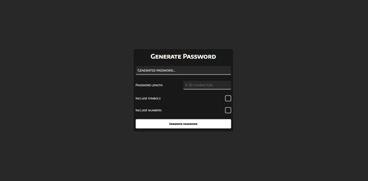
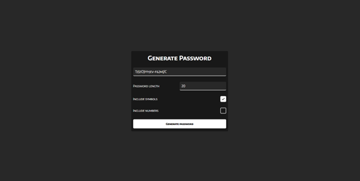

# Password Generator App

    

    

## Description

This is a simple React based password generator that allows the user to generate strong and secure passwords to protect their online accounts. It's a handy tool designed to help them create complex passwords easily.

## Features

- Define the password length: costumizable password length from 6 to 30 characters
- Include numbers: includes numbers from 0 to 9 during the password generation
- Include special characters: includes the special characters "[]{}!?|-\_\*#/()&%$" during the password generation
- Responsive design to adapt to different screen sizes

## Live demo

You can try out the Password Generator Web App by visiting the [live demo](https://zack1808.github.io/password-generator/)

## How to run the app locally

If you want to run the app localy:

#### 1. Clone the repository

- HTTPS: `git clone https://github.com/Zack1808/password-generator.git`
- SSH: `git clone git@github.com:Zack1808/password-generator.git`
- GitHub CLI: `gh repo clone Zack1808/password-generator`

#### 2. Enter the project directory

`cd password-generator`

#### 3. Allow the app to install the necessary packages (Node.js has to be installed on the device)

`npm install`

#### 4. Start the app

`npm start`

After execution, the localhost server will startup and a browser window will open, previewing the password generator app.

## Contribution

Contributions to the Quiz Game project are welcome. If you want improve the user interface, or fix any issues, feel free to create a pull request. Make sure to follow the project's coding conventions and provide detailed information about your changes.

## Contact

If you have any questions or suggestions, you can reach me via:

- Mail: jeanpierrenovak23@gmail.com
- My portfolio: [jeanpierrenovak.netlify.app](https://jeanpierrenovak.netlify.app)

---

Stay safe and secure online!
